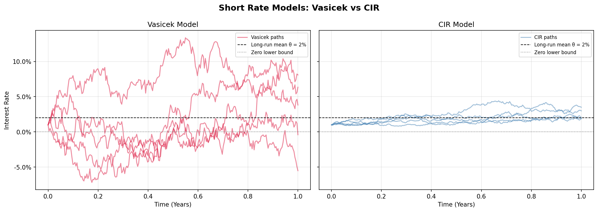
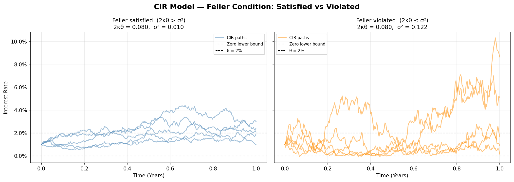

# Interest Rate Modeling: CIR vs Vasicek

This repository provides a Python implementation of the **Cox-Ingersoll-Ross (CIR)** and **Vasicek** models. It focuses on the simulation of short-term interest rate dynamics and highlights the impact of the non-negativity constraint.

---

## Mathematical Background

Both models describe the evolution of the instantaneous interest rate $r_t$ through mean-reverting stochastic differential equations.

### Vasicek Model

The rate follows a process with constant volatility:

$$dr_t = \kappa(\theta - r_t)dt + \sigma dW_t$$

**Issue:** The probability of $r_t < 0$ is strictly positive, which may be inconsistent with certain economic environments.

### Cox-Ingersoll-Ross (CIR) Model

The CIR model introduces a state-dependent volatility to ensure non-negativity:

$$dr_t = \kappa(\theta - r_t)dt + \sigma\sqrt{r_t}dW_t$$

**Advantage:** The $\sqrt{r_t}$ term prevents the rate from becoming negative.

---

## The Feller Condition

A critical aspect of the CIR model is the **Feller condition**. If the following inequality holds, the process $r_t$ is guaranteed to stay strictly positive ($r_t > 0$):

$$2\kappa\theta > \sigma^2$$

If this condition is not met, the process can reach zero, although it remains non-negative.

---

## Comparison Table

| Feature | Vasicek | CIR |
| :--- | :--- | :--- |
| **Mean Reversion** | Yes | Yes |
| **Volatility** | Constant ($\sigma$) | Stochastic ($\sigma\sqrt{r_t}$) |
| **Distribution** | Normal | Non-central Chi-squared |
| **Negative Rates** | Possible | Impossible |

---

## Results

### Vasicek vs CIR — Multi-path Simulation


### CIR — Feller Condition: Satisfied vs Violated


## Repository Structure

```
.
├── main.py
├── README.md
└── assets/
    ├── vasicek_vs_cir.png         # Multi-path comparison of both models
    └── cir_feller_condition.png   # CIR: Feller condition satisfied vs violated
```
